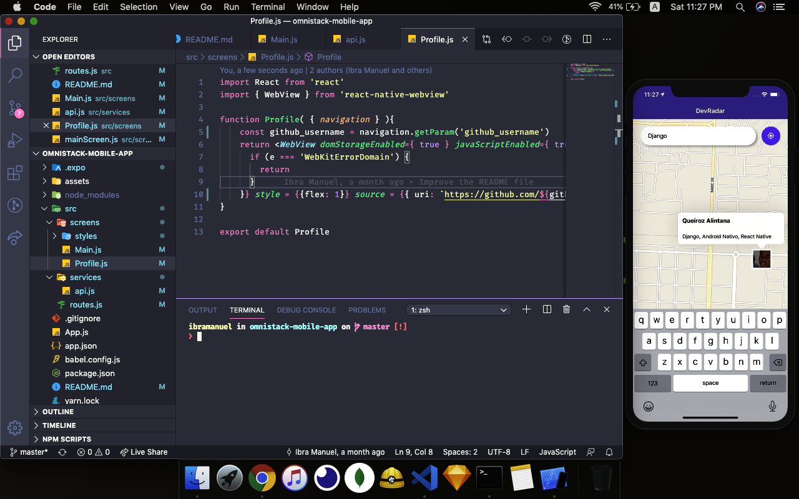

# Devradar mobile app

Introduction
-------------

> This repository contain the mobile implementation of **dev-radar**. A React Native mobile app that helps devs find other devs that are working on the same techs.

Used techs
----------

> * Expo
> * React Native

How to work with
-----------------
> To work with this projects you need run the following commands:
> * git clone https://github.com/ibrahim-manuel/dev-radar-mobile-app
> * yarn global add expo-cli
> * cd dev-radar-mobile-app
> * expo start **or** yarn start
